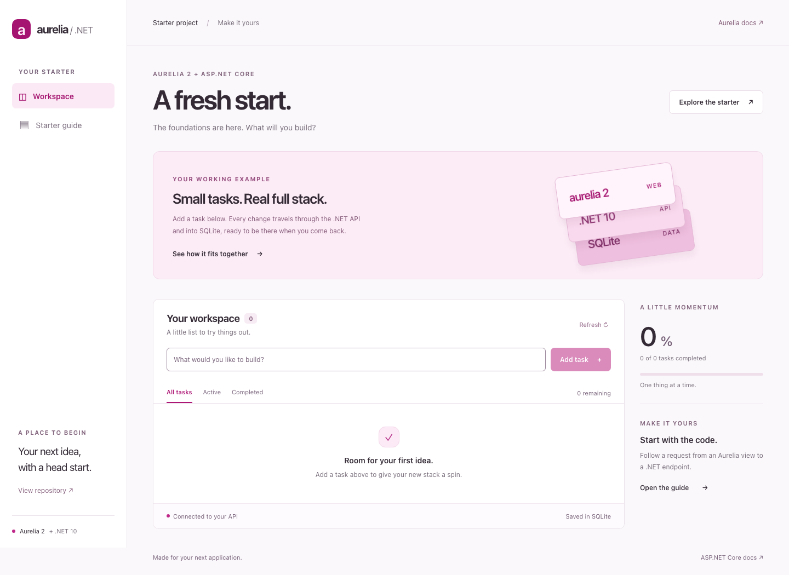

# Aurelia 2 + .NET

An Aurelia 2 frontend and ASP.NET Core 10 API in one repository. The sample task workspace has an Aurelia pink theme, persistent SQLite storage, and a typed API client generated from OpenAPI.

Create a task, rename it, mark it complete, and refresh the page. The example follows that change through the view, API, and database. Replace the task feature with your own when you're ready.



## Run locally

Install **Node.js 24 LTS** and the **.NET 10 SDK, version 10.0.400 or newer within .NET 10**. Aurelia is pinned to **2.0.0-rc.2**, the current release candidate. All Aurelia packages use the same version.

```sh
git clone https://github.com/Vheissu/au2-dotnet.git
cd au2-dotnet
npm ci
npm run dev
```

Open **http://127.0.0.1:5173**. The API listens on `http://127.0.0.1:5080`; Vite proxies `/api`, `/health`, and `/openapi` to it. Both processes stop with Ctrl+C. You don't need a database server or a trusted development certificate.

The API creates its local SQLite database and applies checked-in migrations in Development. The workspace starts empty. No sample data is inserted into your database.

The npm commands find `dotnet` on your PATH or in `~/.dotnet`. Set `DOTNET_EXECUTABLE` if your SDK lives elsewhere. `.nvmrc` selects Node 24, and `global.json` selects the .NET SDK.

## What's included

| Area          | Implementation                                                                            |
| ------------- | ----------------------------------------------------------------------------------------- |
| Frontend      | Aurelia 2, TypeScript in strict mode, Vite 8, lazy routes, native CSS                     |
| API           | ASP.NET Core 10 Minimal APIs, typed results, built-in validation, Problem Details         |
| Persistence   | EF Core 10, SQLite, checked-in migrations, optimistic concurrency                         |
| API contracts | OpenAPI to TypeScript with `openapi-typescript`; requests use `openapi-fetch`             |
| Tests         | Vitest, Aurelia component fixtures, xUnit API tests, Playwright, axe accessibility checks |
| Delivery      | GitHub Actions, lockfiles, Dependabot, combined .NET publish, non-root Docker image       |

The UI includes loading, empty, validation, and failure states. A failed create preserves the draft; a failed update preserves the displayed task. Updates and deletes send a version token, and stale requests get a `409` instead of overwriting another browser's changes.

## Project layout

```text
src/
  Starter.Api/
    Features/WorkItems/     Endpoints, requests, responses, and entity
    Data/                  EF Core context and migrations
    Program.cs             Application composition
  Starter.Web/
    src/
      routes/              Workspace, guide, and not-found pages
      api/                 Typed client and generated contracts
      styles.css           Aurelia pink palette and responsive layout
    test/                  View model, client, and component tests
tests/Starter.Api.Tests/    HTTP integration tests with isolated SQLite files
e2e/                       Browser tests against the published application
scripts/                   Cross-platform development and publish helpers
```

A feature owns its endpoint mappings and contracts. EF Core already provides change tracking and a unit of work, so this example uses it directly. Add application services when business logic needs them; a generic repository or mediator isn't required to create a task.

## Commands

Run these from the repository root:

| Command                               | Purpose                                                      |
| ------------------------------------- | ------------------------------------------------------------ |
| `npm run dev`                         | Watch the API and run Vite together                          |
| `npm run dev:api` / `npm run dev:web` | Run either side independently                                |
| `npm run check`                       | Lint, typecheck, run frontend and API tests, and build       |
| `npm test`                            | Run Vitest and xUnit                                         |
| `npm run test:e2e`                    | Publish and test the application at desktop and mobile sizes |
| `npm run format`                      | Format frontend/config/docs and C#                           |
| `npm run format:check`                | Check formatting without changing files                      |
| `npm run api:types`                   | Regenerate the checked-in TypeScript API schema              |
| `npm run publish`                     | Write the API and frontend into `.artifacts/publish`         |
| `npm start`                           | Run that published app from its own content directory        |

Before your first browser test run:

```sh
npx playwright install chromium
npm run test:e2e
```

Browser tests run against the actual published .NET host on port `5081`, with a temporary database. They cover task changes, reload persistence, stale updates, API failure recovery, direct routes, browser history, responsive overflow, and automated WCAG checks. API integration tests use a separate SQLite database per test, exercising migrations and the actual relational provider. None of these tests use your development database.

CI runs the checks, verifies generated contracts haven't drifted, runs browser tests, and builds the Docker image. Browser traces and screenshots are uploaded on failure. Automated accessibility tests are a baseline; check keyboard and screen-reader behavior when adding new controls.

## Working with the API

The development OpenAPI document is at [http://127.0.0.1:5080/openapi/v1.json](http://127.0.0.1:5080/openapi/v1.json). It is disabled outside Development. `/health` checks database connectivity.

| Method | Path                               | Result                                                       |
| ------ | ---------------------------------- | ------------------------------------------------------------ |
| GET    | `/api/work-items`                  | List tasks                                                   |
| GET    | `/api/work-items/{id}`             | Read a task                                                  |
| POST   | `/api/work-items`                  | Create with `{ "title": "Build something" }`                 |
| PUT    | `/api/work-items/{id}`             | Update with `title`, `isComplete`, and the current `version` |
| DELETE | `/api/work-items/{id}?version=...` | Delete if the version still matches                          |

Titles are required, trimmed on save, and limited to 120 characters. Validation returns `400` Problem Details with an `errors` object; missing tasks return `404`; stale versions return `409`. Unexpected errors are logged with a trace ID and return a generic message.

After changing a request or response:

```sh
npm run api:types
npm run typecheck
```

The generator starts a temporary development API on an available localhost port, reads its OpenAPI document, and shuts it down. It uses a disposable SQLite database. Commit `src/Starter.Web/src/api/generated/schema.d.ts` with the C# change. Don't edit it manually.

## Database changes

Install the repository's pinned EF tool once:

```sh
dotnet tool restore
```

After changing the model:

```sh
dotnet ef migrations add DescribeYourChange --project src/Starter.Api --output-dir Data/Migrations
```

Review and commit the migration and model snapshot. Development startup applies pending migrations. For an explicit update, use `npm run db:migrate`.

Configure the connection string with `ConnectionStrings__Database` or .NET user secrets. User secrets need a one-time `dotnet user-secrets init --project src/Starter.Api`, which gives your copy of the project its own secrets ID. This example uses an absolute database path:

```sh
ConnectionStrings__Database='Data Source=/absolute/path/starter.db' npm run dev:api
```

The API creates the database's directory on startup. Relative SQLite paths resolve against the API process's working directory: `src/Starter.Api` for development and `.artifacts/publish` for `npm start`. Local data lives under `App_Data/` and is ignored by Git. To reset development data, stop the API and remove that directory; the next development start recreates the schema.

For production, apply migrations as an explicit deployment step, against the target connection string, before starting the new app. Back up the database first. Startup migration is off outside Development unless `Database__ApplyMigrations=true` is explicitly set. A single-instance demo can use that switch; a scaled deployment should have one migration runner.

## Publish as one application

```sh
npm run publish
Database__ApplyMigrations=true ASPNETCORE_URLS=http://127.0.0.1:8080 npm start
```

Open **http://127.0.0.1:8080**. ASP.NET Core serves the built frontend and API from one origin. Direct requests to `/guide` load the SPA; unknown `/api/...` URLs remain JSON `404` responses. The command above enables migrations for a local published demo. Omit that switch when your deployment applies migrations separately.

The environment-variable examples use POSIX shell syntax. In PowerShell, set variables first, for example `$env:Database__ApplyMigrations = 'true'`, then run `npm start`.

### Docker

```sh
docker compose up --build
```

Open **http://127.0.0.1:8080**. Compose binds to localhost and stores SQLite in the `starter-data` volume. The container runs as the .NET image's non-root application user. `docker compose down` keeps the data; adding `--volumes` deletes it.

The Dockerfile builds both projects in separate stages, then copies only their outputs into the ASP.NET runtime image.

The published host sends `Cache-Control: immutable` for Vite's fingerprinted `/assets` files and `no-cache` for `index.html`, so browsers pick up a new deployment on the next load. Every response also carries `X-Content-Type-Options`, `Referrer-Policy`, and a Content Security Policy that only allows same-origin resources. Extend the policy in `Program.cs` when you add a CDN, web fonts, or analytics. Configure TLS at your hosting platform or reverse proxy. When using proxy-derived scheme or client IP, configure forwarded headers for trusted proxies before relying on those values.

## Where the starter stops

The sample workspace is deliberately shared and unauthenticated. Before exposing it to untrusted users, add authentication, enforce ownership on every API operation, and choose a suitable CSRF strategy if you use cookies. Client-side route guards don't authorize API calls.

The list endpoint returns all tasks, which keeps this example easy to read. Add pagination when the dataset grows. SQLite is a useful single-instance starting point; choose a server database for multiple application replicas. Rate limits, audit history, telemetry, and backup schedules depend on the application you're building and aren't preconfigured here.

Vite's development proxy avoids the need for CORS in this setup. A separate frontend deployment needs a proxy or an explicit origin allowlist. Values shipped to the browser are public; keep secrets in server configuration, not `VITE_*` variables or source files.

## Troubleshooting

- **The API is unreachable:** check the API terminal output and port `5080`. Both processes must be running. `API_PROXY_TARGET` overrides the development proxy target when the API uses a different address.
- **A port is already occupied:** stop the other process. Vite intentionally refuses to choose another port. Use `WEB_PORT=5175 npm run dev` to choose a different frontend port. Browser tests reserve `5081`. The contract generator chooses an available port.
- **The .NET SDK isn't found:** install the SDK, not just the runtime. Check `dotnet --list-sdks`; the selected SDK must satisfy `global.json`.
- **A task changed elsewhere:** refresh the list, then retry your edit. Version conflicts are deliberate.
- **SQLite cannot open the database:** check that the app user can create and write to the database's directory. Container data belongs in `/app/App_Data`.

## References

[Aurelia documentation](https://docs.aurelia.io/) · [ASP.NET Core](https://learn.microsoft.com/aspnet/core/?view=aspnetcore-10.0) · [EF Core migrations](https://learn.microsoft.com/ef/core/managing-schemas/migrations/) · [OpenAPI in ASP.NET Core](https://learn.microsoft.com/aspnet/core/fundamentals/openapi/overview?view=aspnetcore-10.0)

MIT licensed. See [LICENSE](LICENSE).
